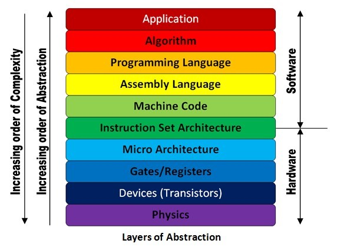

# Clase 1: La base de la era digital: *El Ordenador*

### Objetivo

Mediante esta clase se pretende dotar a los alumnos de ciertos conocimientos previos antes de adentrarnos en la era digital. Para ello, se expondrán múltiples definiciones y conceptos que servirán para aclarar cuestiones que irán saliendo a lo largo de la asignatura. Por otro lado, para interiorizar el comportamiento de un ordenador, máquina base de la era digital, se dispondrá de una práctica sobre el procesador c5i.

| Contenido | Duración |
| ----- | ----- |
| **Clase** | 1 hora - 1 hora y 30 minutos |
| **Práctica procesador c5i** | 30 minutos |

## 1.1	Introducción: Definición de conceptos previos

Los anteriores links definen los conceptos necesarios para definir los componentes básicos de un ordenador. El profesor de la asignatura podrá elegir los que más se ajusten a sus necesidades.

Definiciones:

1- [Definición de Procesador](https://www.google.com/search?rlz=1C1CHBD_esES774ES778&ei=iLzKXNTmL4XPgweYwJPIAg&q=definci%C3%B3n+procesador&oq=definci%C3%B3n+procesador&gs_l=psy-ab.3..35i304i39i70i249j35i304i39j0i13j0i22i30l7.75188.85512..85707...0.0..1.514.4009.3j9j3j4j0j1....2..0....1..gws-wiz.......0i71j35i39j0i67j0i131j0j35i39i70i249j0i20i263j0i10j0i67i70i249j0i13i30j0i8i13i10i30j0i8i13i30.gdrVvqxmiYI)

2- [Definición de ordenador y sus componentes](https://www.deordenadores.com/cuales-son-los-componentes-de-un-ordenador/)

3- [Definición de componentes de los procesadores, hardware, caché, etc.](https://conceptodefinicion.de/procesador/)

4- [Tecnología-informatica componentes de ordenador más a fondo](https://tecnologia-informatica.com/componentes-de-una-computadora/)

*Ejemplo:*

*Ordenador: Un ordenador es un equipo capaz de calcular y ordenar información, y de ahí su nombre del latín —computare— y del español—ordenador—.*

*Hardware: todo equipo físico empleado en la máquina*

*Software: colección de código instalado en el disco duro del ordenador.*

*Procesador: Componente electrónico donde se realizan los procesos lógicos*

#### *1.1.2 Esquema de la arquitectura de diseño de hardware y software:* (Opcional)

[Esquema de la arquitectura](https://sites.google.com/site/yhouycsp/reflections/2-10-hardware-and-software-abstractions)

[Arquitectura de Harware](https://electronics.stackexchange.com/questions/353915/what-is-the-role-of-isa-instruction-set-architecture-in-the-comp-arch-abstract)

## 1.2	Procesadores: 

### 1.2.1 Función

1- [Explicar que es un procesador](https://conceptodefinicion.de/procesador/)

2- [Definir puertas lógicas](http://natypine7.files.wordpress.com/) y [las operaciones que realizan](https://www.etsist.upm.es/estaticos/ingeniatic/index.php/tecnologias/item/563-puertas-l%C3%B3gicas%3Ftmpl=component&print=1.html)

*Ejemplo:*

*Un procesador es un componente electrónico donde se realizan los procesos lógicos. Para ello, se emplean las puertas lógicas que a su vez son circuitos de conmutación integrados en un chip inventados por Claude Elwood Shannon en 1938.*

*Por tanto una puerta lógica, o compuerta lógica, es un dispositivo electrónico que es la expresión física de un operador booleano en la lógica de conmutación. Cada puerta lógica consiste en una red de dispositivos interruptores que cumple las condiciones booleanas para el operador particular. Son esencialmente circuitos de integración integrados en un chip.*

*En resumidas cuentas, una puerta lógica es un dispositivo capaz de realizar las siguientes operaciones:*

*Puerta SÍ ( F=A ), puerta AND ( F=A*B ), puerta OR ( F=A+B ), puerta XOR ( F=A’B+AB’ ), puerta NOT ( F=A’ ), puerta NAND ( F=(AB)’ ), puerta NOR ( F=(A+B)’ ),  puerta XNOR( F=AB+A’B’ )*

### 1.2.2 Situación actual: Empresas y mercado en la actualidad

[Mercado mundial](http://rsocial.expansionpro.orbyt.es/epaper/xml_epaper/Expansi%C3%B3n/23_03_2018/pla_3995_Pais_Vasco/xml_arts/art_15913300.xml?SHARE=6C23C0F29C6C4F158F7CA6264B486305B653D3AF53CFD54244B9CF7F68DE73BF14CBCE99C5EC78615BF7C9B4D7C7F90607B0FB44DE6065CB19F2D0AC7F842D244C32B6546A48F6A2C32ED77B3375B50D79C402F47193576E1367062FF0C4154A)

*Ejemplo*

*Valor de las operaciones anuales del mercado: 115.565 millones de euros (2018). El veto por parte del gobierno estadounidense a la opa de Broadcom sobre Qualcomm.*

## 1.3	Ley de Moore

### 1.3.1 ¿Qué es? Y para qué sirve?

### 1.3.2	¿Qué ha implicado hasta el día de hoy? ¿Sigue siendo válida?

## 1.4	Relación entre los dos conceptos previos

### 1.4.1 Qué supone esto para el mercado global

### 1.4.2 
